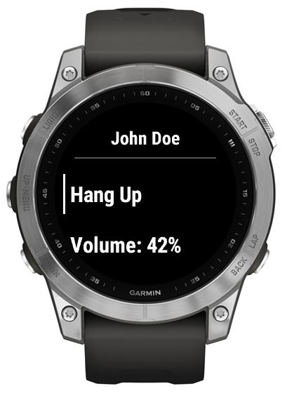

# Call control

Handsfree does not impose any limitations on you starting or accepting a call via watch: feel free to start or accept a call with Handsfree, *or* with your phone/other device and use Handsfree to take control later, and vice versa: Handsfree got you covered in most cases.

When you want to control a call in progress from your watch, just open Handsfree - the call controls will be there for you.

To go back to the watch without hanging up the call, just select Back.

To return to the call in progress after going back to watch, just launch the app again.

Using Handsfree [glance](./Glance.md), it's even possible to use Handsfree during an activity: as long as you can get to your watch face (e.g. via a Hotkey), all your glances should be available, Handsfree included.

 

Besides "Hang Up" option, you can have some control over [call audio](./In-Call-Audio.md) from the same screen.