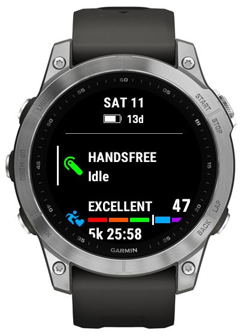

# Glance

(On supported devices) glance view provides you with overview of a call in progress, as well as show you the extra information when idle:

-   Missed calls
-   Headset state: when it's not connected, `#` appended to the title or just shown as "NO HEADSET".

  

