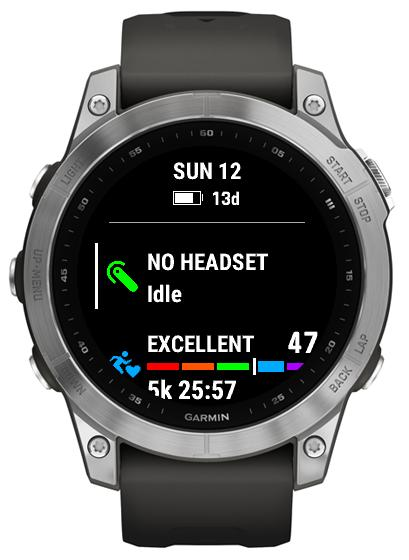

# Headset connection status

*When you're not wearing a headset*/*have no external speaker connected to your phone*, Handsfree communicate that to you *beforehand* to avoid getting into a situation where you end up not hearing the other party because your phone is e.g. in your pocket but without headset connected.

This is done by adding "#" to some titles or shown directly as "NO HEADSET" on the [glance](./Glance.md).

