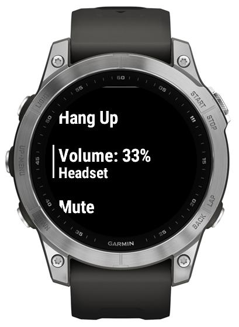
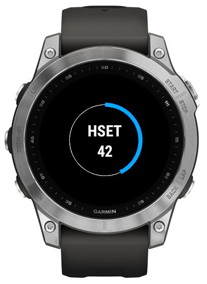

# In-call audio control

On a call in progress screen there're two items to control the audio:

-   Volume: XXX% - shows the current audio volume and audio output. Selecting the item will open the volume control screen.
    
-   Mute/Unmute - lets you temporarily mute *your microphone*, so that the other party would not hear you.

    

The labels shown on the volume control screen indicate the type of the output.

-   SPKR - Loud speaker

-   HSET - (Wireless) headset

-   WHST - Wired headset

-   PHNE - Ear speaker

    

Beware that due to technical limitations, Handsfree does not provide a way to switch audio devices during a call in progress.

