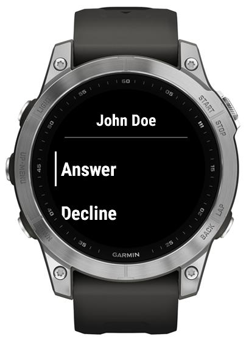

# Incoming calls

With Handsfree you can accept incoming calls, though there're a couple nuances related to incoming call notification:

1.   For most devices, with notable exception of Fenix 7 family, Handsfree does not provide continuous vibration on incoming call. Hence, if you rely on vibration (vs some other means for notification about the call), it may be beneficial to keep using the Garmin-provided incoming call handling, specifically, on devices that have continuous vibration supported.
2.   For Fenix 7 family of devices Handsfree provides quite elaborate/seamless experience, including continuous and customizable vibration.

It's recommended to give it a try/compare it to native handling of incoming calls,

To enable Handsfree handling of incoming calls:

1.   Select "Ringing" in Settings of Handsfree on your watch, to let Handsfree alert you (and even vibrate the watch[^1]) on incoming call.

      

2.   (Optionally) disable Garmin's own support for accepting the calls on the watch.

3.   On an incoming call, you'll get a notification about a call, that prompts into launching Handsfree app. [^1]
     If you want to accept or decline the call on your watch, select "Launch".

4.   Handsfree will be launched and you'll get the prompt to Accept, Decline or Ignore the call [^2]:

      

     

     [^1]: On Fenix 7 family of devices, *when the watch is idle/showing the watch face*, notification for launching the app is omitted and you get right to Accept/Decline/Ignore prompt
     [^2]: On Fenix 7 family of devices, *when the watch is idle/showing the watch face*, the prompt is accompanied by vibration, until it is dismissed. To stop the vibration and dismiss the call without accepting or declining the call, select Ignore.

Please note that the [headset status](./Headset-Status.md) is visible on Incoming Call screen: if you don't have a headset connected, you'll see "#" displayed after the caller name, to let you know that the audio would be routed to the *ear speaker* hence making it impossible to hear the other party without grabbing the phone or e.g. plugging a headset.
