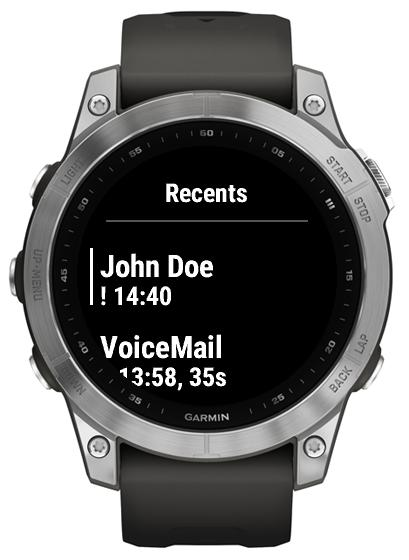

# Missed calls

Missed calls are displayed on the glance, as well in the list of Recents, marked with "!". They are cleared (on the watch) after opening Recents.

If you have calls missed, on opening the app you'll get right into Recents. Next time it will return to Contacts screen.

  

