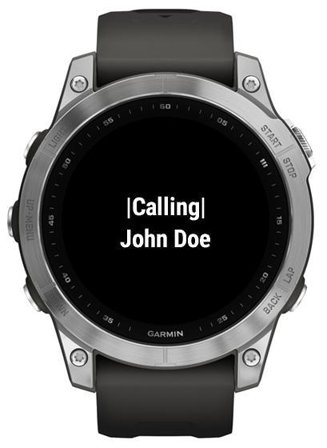

# Making calls

Make sure you starred some contacts on your phone.

Open the app on the watch.

Select a contact phone to start the call.

If the phone is not connected to a headset, Handsfree will automatically activate the phone speaker. (Beware that this function is not available on accepting the calls.)

 