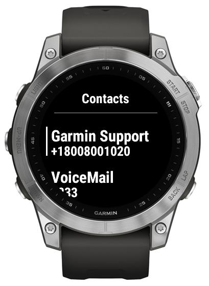

# Making calls

1.   Make sure you starred some contacts on your phone.
2.   Open the app on the watch.
3.   Select a contact phone to start the call.

Beware that maximum of 20 contacts (5 for low-memory devices) can be synced to your Garmin device.

 

