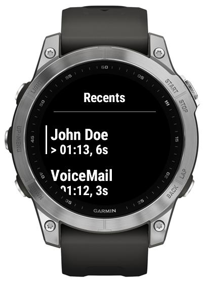

# Recent contacts

With Recents you should see the recently called contacts (max 5), as well as the date/time of the last call associated with the given contact and indicator of the type of the call:

-   ">" - incoming call
-   "<" - outgoing call
-   "-" - declined call
-   "!" - (new) missed call
-   "?" - (old) missed call
-   "r" - call routed to voicemail
-   "b" - blocked call
-   "a" - answered externally

Selecting an entry in the recent calls, triggers a call to the contact selected.

  